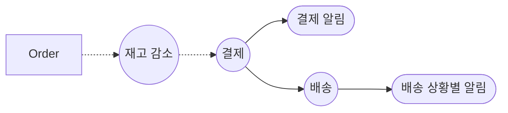
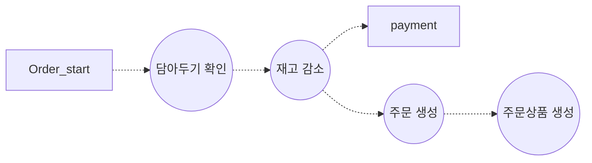

### 요구사항 분석 

- 회원 기능 
	- 회원 등록
	- 회원 조회 
	  
- 주문 기능 
	- 상품 주문 
	- 주문 내역 조회 
	- 주문 취소 
	  
- 상품 기능 
	- 상품 등록
	- 상품 조회
	- 상품 수정 
	  
- 결제 기능 
	- 결제 

### 모델링 

회원 (Customer)
- id
- name
- password 
- Address 

주문 (Order)
- id 
- customer_id(fk)
- status(created, paid, shipped, cancelled)

상품(Product)B
- id 
- name
- price 
- stockQuantity

cart 
- cart_id 
- customer_id
- created_at
- updated_at

cart_Item
- cart_item_id
- cart_id
- product_id
- quantity
- added_at

OrderProduct 
- id
- order_id (fk)
- product_id(fk)
- quantity ???
- orderPrice 

Payment 
- id 
- order_id (fk)
- paid_at 
- Status (SUCCESS, FAILED, PROGRESS)
- Method(NAVER, KAKAO)
- amount 

Address
- id 
- customer_id
- 

### 주문 기능 흐름 

### 각 기능 별 요구사항 심화 

#### 카트

1. 담아두기 (orderItem)
	- user의 카트 없으면 생성 
	- user의 카트 있으면 기존 카트에 추가 
	  
2. 

#### 배송 

품목별 배송 조회 
- 주문 전체가 아닌, 품목별로 배송 스케줄·상태가 달라지는 경우
- **order_product** 테이블과 1:1 (혹은 1:N) 으로 **delivery** 연결
- 이때 `order_product_delivery` 같은 중간 테이블을 별도로 두는 것이 명확

https://jki09871.tistory.com/64